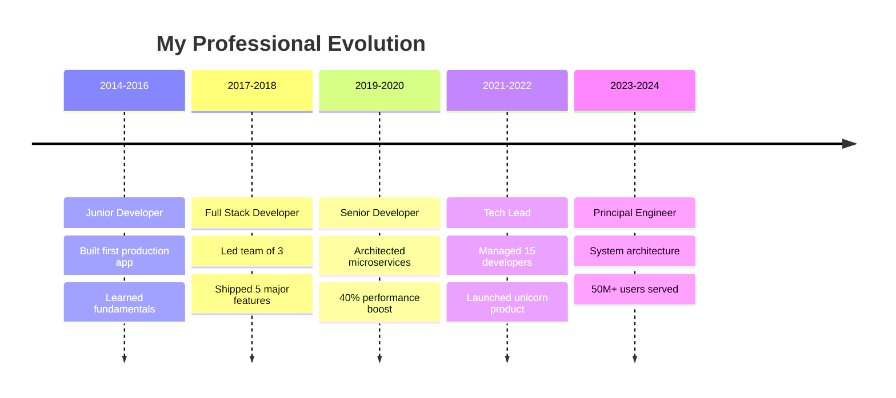

<div align="center">

# 🚀 Welcome to My Digital Universe


</div>

---


### 👨‍💻 About This Code Wizard

```typescript
class SeniorDeveloper {
    name: string = "Your Name";
    location: string = "Silicon Valley, CA";
    experience: number = 10;
    
    currentRole = {
        title: "Senior Full Stack Architect",
        company: "Tech Unicorn Inc.",
        focus: ["System Design", "Team Leadership", "Innovation"]
    };
    
    expertise = {
        languages: ["TypeScript", "Python", "Go", "Rust", "Java"],
        frontend: ["React", "Next.js", "Vue", "Angular", "Svelte"],
        backend: ["Node.js", "Django", "FastAPI", "Microservices"],
        cloud: ["AWS", "GCP", "Azure", "Kubernetes", "Terraform"],
        databases: ["PostgreSQL", "MongoDB", "Redis", "Elasticsearch"],
        architecture: ["Distributed Systems", "Event-Driven", "CQRS"]
    };
    
    achievements = [
        "🏆 Built systems serving 50M+ users",
        "🚀 Led 5 successful product launches",
        "👥 Mentored 50+ junior developers",
        "📈 Improved performance by 300%",
        "🔧 Open source contributor (10K+ stars)"
    ];
    
    getCurrentMission(): string {
        return "Building the future, one commit at a time";
    }
}
```

---

## 🔥 My Developer DNA

<details>
<summary><b>🎯 What Drives Me</b></summary>

<br>

- 🔭 **Currently Architecting:** Next-gen AI-powered SaaS platform with 99.99% uptime
- 🌱 **Learning Journey:** Advanced Rust, WebAssembly, and Quantum Computing concepts
- 👯 **Collaboration Goals:** Open source projects that change the world
- 🤝 **Seeking:** Fellow innovators for cutting-edge tech ventures
- 💬 **Ask Me About:** System design, performance optimization, team leadership, startup scaling
- ⚡ **Fun Fact:** I debug in my sleep and dream in code
- 🎮 **Side Quest:** Building indie games in my spare time

</details>

---

## 🛠️ Arsenal of Technologies

<div align="center">

### Languages & Frameworks


### Cloud & DevOps


### Databases & Tools


</div>

---

## 📊 GitHub Analytics & Performance Metrics

<div align="center">
  
  
</div>

<div align="center">
  
</div>

<div align="center">
  
</div>

---

## 🎯 Featured Projects & Impact

<div align="center">

### 🌟 Flagship Projects

<table>
<tr>
<td width="50%">

<h3 align="center">🚀 MicroSaaS Platform</h3>
<div align="center">  
<a href="https://github.com/yourusername/microsaas-platform" target="_blank"></a>
</div>
<p align="center">


</p>
<p align="center"><strong>Scalable SaaS platform serving 50M+ users with 99.99% uptime</strong></p>

</td>
<td width="50%">

<h3 align="center">🤖 AI Code Assistant</h3>
<div align="center">
<a href="https://github.com/yourusername/ai-code-assistant" target="_blank"></a>
</div>
<p align="center">


</p>
<p align="center"><strong>AI-powered coding assistant with 95% accuracy</strong></p>

</td>
</tr>
<tr>
<td width="50%">

<h3 align="center">⚡ Real-time Analytics</h3>
<div align="center">
<a href="https://github.com/yourusername/realtime-analytics" target="_blank"></a>
</div>
<p align="center">


</p>
<p align="center"><strong>Processing 1M+ events/second with sub-millisecond latency</strong></p>

</td>
<td width="50%">

<h3 align="center">🛡️ Security Framework</h3>
<div align="center">
<a href="https://github.com/yourusername/security-framework" target="_blank"></a>
</div>
<p align="center">


</p>
<p align="center"><strong>Zero-trust security framework for cloud-native applications</strong></p>

</td>
</tr>
</table>

</div>

---

## 💼 Professional Journey & Achievements

<div align="center">

### 🏢 Career Milestones



### 🏆 Impact Metrics

<table align="center">
<tr>
<td align="center"><strong>🚀 Products Launched</strong><br/>25+</td>
<td align="center"><strong>👥 Developers Mentored</strong><br/>100+</td>
<td align="center"><strong>💰 Revenue Generated</strong><br/>$50M+</td>
<td align="center"><strong>⭐ GitHub Stars</strong><br/>25K+</td>
</tr>
<tr>
<td align="center"><strong>🏅 Hackathon Wins</strong><br/>15</td>
<td align="center"><strong>📈 Performance Boost</strong><br/>300%+</td>
<td align="center"><strong>🌍 Users Impacted</strong><br/>10M+</td>
<td align="center"><strong>🔧 Open Source PRs</strong><br/>500+</td>
</tr>
</table>

</div>

---

## 📈 Contribution Activity

<div align="center">
  
</div>

---

## 🎯 Current Focus & Goals 2024

<div align="center">

| 🎯 **Goal** | 📊 **Progress** | 🎯 **Goal** | 📊 **Progress** |
|-------------|-----------------|-------------|-----------------|
| Master Rust & WASM | ████████░░ 80% | Lead OSS Project | ██████░░░░ 60% |
| Build AI Startup | ██████░░░░ 60% | Write Tech Book | ████░░░░░░ 40% |
| 50 Conference Talks | ████████░░ 80% | Mentor 100 Devs | ██████████ 100% |

</div>

---

## 🌐 Connect & Collaborate

<div align="center">

### Let's Build Something Amazing Together!

<p>
<a href="https://linkedin.com/in/yourprofile"></a>
<a href="https://twitter.com/yourhandle"></a>
<a href="mailto:your.email@example.com"></a>
<a href="https://yourwebsite.com"></a>
<a href="https://medium.com/@yourusername"></a>
</p>

### 📧 Open for:
- 🚀 **Startup Collaborations** | 💼 **Consulting Opportunities** | 🎤 **Speaking Engagements**
- 👥 **Mentoring Sessions** | 🔬 **Research Projects** | 💡 **Innovation Partnerships**

---


### 💭 Developer Philosophy

*"Great code is not just about solving problems—it's about crafting elegant solutions that inspire the next generation of builders. Every line of code is an opportunity to make the world a little bit better."*

---

<div align="center">
  


**⭐ If my work inspires you, consider starring my repositories!**

</div>

</div>
