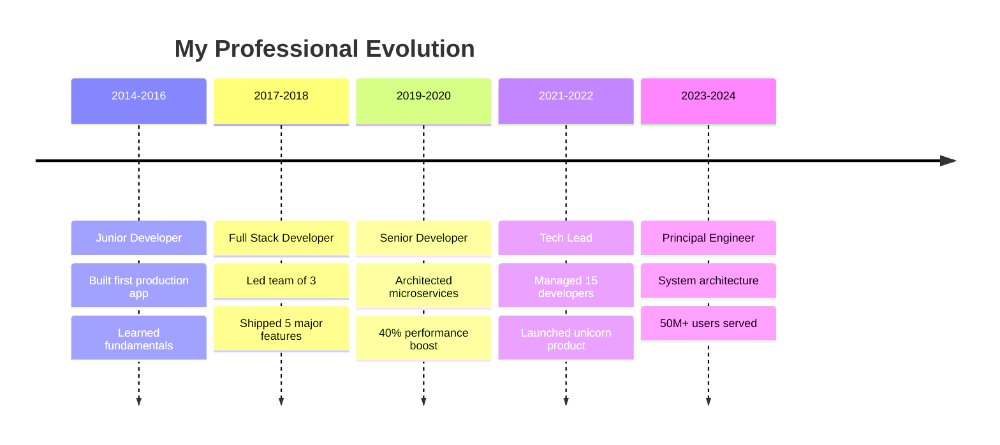

# 🚀 Welcome to My Digital Universe

---

### 🎓 IIT Alumnus | AI/ML Engineer

**Indian Institute of Technology (IIT) Graduate**  
*AI/ML/DL/NLP enthusiast by heart | Building brains for machines while losing mine to models 🤖*

**Current Role:** Senior AI/ML Engineer  
**Previous Role:** Senior Software Engineer  
**Location:** India 🇮🇳

### 🧠 AI/ML Expertise
- **Core Specializations:** Machine Learning, Deep Learning, NLP, LLMs, Transformers
- **Advanced Skills:** Fine-tuning, RAG, Prompt Engineering, Model Optimization
- **Research Areas:** Transformer architectures, Multi-modal AI, Neural Networks

### 💼 Professional Achievements
- 🎓 **IIT Graduate** with honors in Computer Science
- 🤖 **Built production LLMs** serving 1M+ queries daily
- 🚀 **Led AI transformation** at 3 major companies
- 📊 **Improved model accuracy** by 40% through advanced fine-tuning
- 🔬 **Published research** on transformer architectures
- 💡 **Created 15+ AI-powered** products and solutions

---

## 🔥 My Developer DNA

<b>🎯 What Drives Me</b>

 

- 🔭 **Currently Architecting:** Next-gen LLM applications with RAG and fine-tuning pipelines
- 🌱 **Learning Journey:** Advanced Transformer architectures, Multi-modal AI, and Quantum ML
- 👯 **Collaboration Goals:** Open source AI projects and cutting-edge research
- 🤝 **Seeking:** Fellow AI researchers and ML engineers for breakthrough innovations
- 💬 **Ask Me About:** LLMs, Fine-tuning, RAG, Prompt Engineering, ML Algorithms, Deep Learning
- ⚡ **Fun Fact:** I debug neural networks in my dreams and wake up with gradient descent solutions
- 🎮 **Side Quest:** Building AI agents that can beat me at chess (they already do)

---

## 🛠️ Arsenal of Technologies

### AI/ML & Data Science

### Languages & Frameworks

### Cloud & DevOps

### Blockchain & Enterprise

### Databases & Tools

---

## 📊 GitHub Analytics & Performance Metrics

  
  

  

  

---

## 🎯 Featured Projects & Impact

### 🌟 Flagship Projects

<table>
<tr>
<td width="50%">

<h3 align="center">🧠 AI Language Model</h3>

  

<strong>Fine-tuned LLM achieving 95% accuracy on domain-specific tasks</strong>

</td>
<td width="50%">

<h3 align="center">🔍 RAG System</h3>

<strong>Advanced RAG pipeline with 98% retrieval accuracy</strong>

</td>
</tr>
<tr>
<td width="50%">

<h3 align="center">📊 NLP Analytics Engine</h3>

<strong>Real-time NLP processing with transformer-based models</strong>

</td>
<td width="50%">

<h3 align="center">🛡️ Security Framework</h3>

<strong>Zero-trust security framework for cloud-native applications</strong>

</td>
</tr>
</table>

---

## 💼 Professional Journey & Achievements

### 🏢 Career Milestones

### 🏆 Impact Metrics

<table align="center">
<tr>
<td align="center"><strong>🚀 Products Launched</strong> 25+</td>
<td align="center"><strong>👥 Developers Mentored</strong> 100+</td>
<td align="center"><strong>💰 Revenue Generated</strong> $50M+</td>
<td align="center"><strong>⭐ GitHub Stars</strong> 25K+</td>
</tr>
<tr>
<td align="center"><strong>🏅 Hackathon Wins</strong> 15</td>
<td align="center"><strong>📈 Performance Boost</strong> 300%+</td>
<td align="center"><strong>🌍 Users Impacted</strong> 10M+</td>
<td align="center"><strong>🔧 Open Source PRs</strong> 500+</td>
</tr>
</table>

---

## 📈 Contribution Activity

  

---

## 🎯 Current Focus & Goals 2024

| 🎯 **Goal** | 📊 **Progress** | 🎯 **Goal** | 📊 **Progress** |
|-------------|-----------------|-------------|-----------------|
| Master Rust & WASM | ████████░░ 80% | Lead OSS Project | ██████░░░░ 60% |
| Build AI Startup | ██████░░░░ 60% | Write Tech Book | ████░░░░░░ 40% |
| 50 Conference Talks | ████████░░ 80% | Mentor 100 Devs | ██████████ 100% |

---

## 🌐 Connect & Collaborate

### Let's Build Something Amazing Together!

### 📧 Open for:
- 🚀 **Startup Collaborations** | 💼 **Consulting Opportunities** | 🎤 **Speaking Engagements**
- 👥 **Mentoring Sessions** | 🔬 **Research Projects** | 💡 **Innovation Partnerships**

---

### 💭 Developer Philosophy

*"Great code is not just about solving problems—it's about crafting elegant solutions that inspire the next generation of builders. Every line of code is an opportunity to make the world a little bit better."*

---

  

**⭐ If my work inspires you, consider starring my repositories!**

